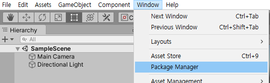
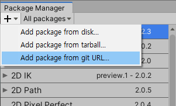

# FAMOZ Common Pacakage

## 개요

파모즈 라이브러리 사용을 위한 Common 패키지입니다.

## 원작성자
- 김태훈
- 김민우

## 기여자

# 시스템 요구사항
Unity 2018.3 버전 이상을 요구합니다.<br>
이전 버전의 경우 테스트를 진행하지 않았으므로, 시도 후 알려주시기 바랍니다. (현재 package.md 파일에 의해 막혀있습니다.)<br>

# 설치

## manifest.json 파일의 scopedRegistries 수정을 통한 패키지 연동 (추천방식)
 - 프로젝트 폴더/Packages 폴더 내부의 manifest.json 파일에 해당 구문을 추가하고 저장하면, UnityEditor에서 해당 패키지를 인식하고 UI상에 표현합니다.<br>
```json
"scopedRegistries": [
    {
        "name": "FAMOZ",
        "url": "http://61.73.79.136:4873/",
        "scopes": [
        "com.famoz"
      ]
    }
  ],
  "dependencies" :{
    ...
  }
```

 - 표현된 패키지들 중 `FAMOZ Common` 패키지를 인스톨하시기 바랍니다.

<!-- 실제 프로젝트에서 패키지 추가하는 이미지 추가하기 -->


## manifest.json 파일 수정을 통한 패키지 설치(비추천)
  - 프로젝트 폴더/Packages 폴더 내부의 manifest.json 파일에 해당 구문을 추가하고 저장하면, UnityEditor에서 해당 패키지를 인식하고 패키지를 설치합니다.<br>
  - 패키지가 설치되지 않은 경우 프로젝트를 재시작하시기 바랍니다.

<!-- 해당 경우의 단점에 대해서 보다 상세히 작성하기. -->

  ```json
  "dependencies" : {
    "com.famoz.common" : "https://github.com/FAMOZ-MINWOO/unitymodule-common.git"
  }
  ```

## 패키지 매니저와 git URL을 통한 패키지 설치 (비추천)
  - 프로젝트 매니저를 열고 git url을 통해 패키지를 설치하시기 바랍니다.

<!-- 해당 경우의 단점에 대해서 보다 상세히 작성하기. -->

  `https://github.com/FAMOZ-MINWOO/unitymodule-common.git`

   

  


# 1. 사용 방법
  대다수의 기능은 사용을 위해 별도의 컴포넌트를 추가할 필요는 없습니다.<br>
  코드 내에서 `namespace FAMOZ`를 통해 접근하여 사용할 수 있습니다.<br>

  일부 기능은 패키지 내부 Prefabs 폴더에 사전 제작된 Prefab을 활용하는 것으로 쉽게 사용할 수 있습니다.

# 2. 주요 기능

  ### Dirty

  dirty flag pattern 사용을 위한 아주 간단한 클래스로 해당 클래스의 `isDirty`를 통하여, 값의 변화 유무를 판단할 수 있다.<br>
  해당 flag값이 true이면 값을 반환하고 즉각 false로 변화하므로 true를 확인한 구문에서 즉각 변화에 대응해야 합니다.<br>
  <br>
  flag값은 `SetDirty()`가 호출되기 전까지 true로 변화하지 않습니다.<br>
  <br>
  [해당 패턴에 대한 세부 설명(영문)](https://gameprogrammingpatterns.com/dirty-flag.html)<br>
  [해당 패턴에 대한 세부 설명(국문)](http://hajeonghyeon.blogspot.com/2017/06/dirty-flag.html)<br>
  <br>

  ### CameraExtension

  카메라의 확장 메소드 집합입니다.<br>
  Screen 좌표계에 대한 함수가 정의되어 있습니다.<br>
  <br>

  <!-- 해당 기능에 대한 예시 이미지 추가하기 -->

  ### BinarySerialization

  오브젝트를 byte로 직렬화하거나 byte를 오브젝트로 역질렬화하기 위한 정적 클래스입니다.<br>
  <br>

  <!-- 해당 기능의 예시 사용처 추가하기 -->

  ### Singleton 관련

  <!-- 해당 기능의 예시 사용처 추가하기, 싱글턴 패턴에 대한 문서 링크하기 -->

  #### Singleton

  MonoBehaviour를 상속하지 않는 기본적인 추상 싱글턴 패턴으로, 해당 클래스의 상속을 통하여서 싱글턴을 구현할 수 있습니다.<br>

  #### SingletonMonoBehaviour

  MonoBehaviour를 상속하는 추상 싱글턴 패턴으로, 해당 클래스의 상속을 통하여서 싱글턴을 구현할 수 있습니다.<br>

  #### SingletonSO

  ScriptableObject의 간단한 싱글턴 패턴으로, 해당 클래스의 상속을 통하여 Singleton ScriptableObject를 구현할 수 있습니다.<br>

  #### SingletonScriptableObject

  MonoBehaviour 사용이 가능한 ScriptableObject의 싱글턴 패턴으로, 해당 클래스의 상속 이후 클래스 내부 Behaviour 변수를 통해 MonoBehaviour 사용이 가능합니다.<br>
  <br>

  ### ObjectPooling

  ```c#
  using FAMOZ.ObjectPooling
  ```

  객체의 반복적인 생성과 소멸에 의한 성능 저하를 막기 위한 기법으로, 개발자가 ObjectPoolingManager와 ObjectPool 컴포넌트 활용을 통해서 사용할 수 있습니다.
  <br>

  [오브젝트 풀링 기법 구현하기(오민호)](https://wergia.tistory.com/203)<br>
  <br>
  <!-- 해당 기능의 예시 사용처 추가하기, 오브젝트 풀링 기법에 대한 문서 링크하기 -->

  ### HTTP
  #### RequestDownload
  ```c#
  static void HttpDownloader.RequestDownload(string downloadUrl, string WritePath, System.Action OnDownloaded = null);
  ```

  다운로드하고자 하는 파일의 Url 주소와 해당 파일을 저장할 Path값을 매개로 하여, 호출할 경우 해당 위치에 파일을 다운로드 및 작성할 수 있습니다.<br>
  다운로드는 비동기적으로 진행되며, 현재 MAX_DOWNLOAD_PEND_COUNT 값을 통하여 동시 다운로드를 제한하고 있습니다.

  ### Loading Scene Management

  Unity Scene 간의 자연스러운 연결과 데이터의 완전한 초기화를 위한 SceneManagemet 입니다.<br>

  - [로딩씬 구현하기 - 커튼방식(오민호)](https://wergia.tistory.com/194)<br>
  - [로딩씬 구현하기 - 씬교체방식(오민호)](https://wergia.tistory.com/183)<br>
  <br>
  <!-- 해당 기능의 예시 사용처 추가하기, Unity에서의 Loading 과정에 대한 문서 링크하기 -->

  ### Extension Method
  #### LinqExtension.ToObject<T>(this IDictionary<string, object>)

  Dictionary를 클래스 인스턴스로 변환하는 확장 메서드입니다.<br>

  #### LinqExtension.AsDictionary(this object, BindingFlags)

  object를 Dictionary<string, object> 형태로 변환하는 확장 메서드입니다.<br>
  <br>
  <!-- 해당 기능 사용처 작성하기 -->

  #### DateExtension.GetTodayAbbreviatedDayName(string culture = "en-us")

  현재 날짜의 각 문화권별 날짜 약어를 불러오기 위한 함수입니다.<br>
  기본 값은 "en-us"로, 미국의 날짜이름을 불러오게 됩니다.<br>
  `(ex) mon, tue, ...`

  #### DateExtension.GetTodayDayName(string culture = "en-us")

  현재 날짜의 각 문화권별 날짜이름을 불러오기 위한 함수입니다.<br>
  기본 값은 "en-us"로, 미국의 날짜이름을 불러오게 됩니다.<br>
  `(ex) Monday, Tuesday, Wednesday, ...`

  #### DateExtension.IsAbbreviatedDayName(string comparison, string culture = "en-us")

  `comparison`이 문화권의 날짜 약어에 해당하는지 확인하는 함수입니다.

  #### DateExtension.IsDayName(string comparison, string cultureb = "en-us")
  
  `comparison`이 문화권의 날짜 이름에 해당하는지 확인하는 함수입니다.

  #### ExtensionEnum.GetFileType(string path)

  파일의 경로를 통하여 해당 파일의 확장자에 접근하고, 해당 파일의 타입이 어떠한 것인지 반환합니다.
  
  ### Audio
  #### SFXManager
  프로그램의 효과음을 중앙제어하기 위한 컴포넌트입니다. 해당 컴포넌트 오브젝트를 Start Scene에 추가하고, Inspector의 제어를 통하여서 사용하고자 하는 효과음을 추가 및 제거할 수 있습니다.
  SFXManager.Instance.PlaySFX()의 호출을 통해 실제 효과음 재생을 수행할 수 있습니다.


  ### Debug
  #### FPS Checker
  프로그램의 FPS를 Unity Editor가 아닌 Player에서 확인하기 위한 컴포넌트입니다. 해당 컴포넌트의 추가를 통해서 FPS 확인이 가능해집니다.


  ### Input

  #### Input.InputEventManager
  키보드 입력에 대한 이벤트 총괄 담당을 하는 InputEventManager입니다.<br>
  
  해당 클래스를 통하여서, 키보드 입력에 따른 이벤트를 총괄제어할 수 있습니다.

  ### RawKeyInput
  Window Focus를 벗어난 경우에도 키 입력을 받기 위한 RawKeyInput입니다. 해당 클래스를 통하여서, 화면을 벗어난 경우에도 키를 입력받을 수 있습니다.

  ### <div id="NotifyVariableChange">Notify Variable Change</div>
  제네릭 클래스로, 해당 클래스의 상속을 통하여서 변수의 변화를 감지할 수 있습니다. 변수가 변화한 경우 특정 이벤트가 발생하도록 제어할 수 있습니다.


  ### EnumFlagAttribute
  인스펙터에서 Enum을 Flag로 사용하기 위해 별도의 PropertyAttribute입니다. [EnumFlagAttribute] 를 사용하여, 인스펙터에서 제어할 수 있습니다.

# 3. 기타 등등

## 종속 모듈
  - 없습니다.

# 4. 변경 로그

## ver 0.0.9
  ### 변경일
  - 2021/03/04
  ### 기여자
  - 김민우 (shahian12@famoz.co.kr)
  ### 변경사항
  - 2018 버전의 Assembly Definition - Use GUID 로 인한 Missing Reference 오류 해결을 위한 Assembly Definition의 변경


## ver 0.0.8
  ### 변경일
  - 2020/12/29

  ### 기여자
  - 김민우 (shahian12@famoz.co.kr)

  ### 변경사항
  - [NotifyVariableChange](#NotifyVariableChange)의 추가가 진행되었습니다.
  - 요일의 이름 비교를 위한 DateExtension이 추가었습니다.
  - EnumFlagAttribute가 추가되었습니다.

## ver 0.0.7
  ### 변경일
  - 2020/11/19

  ### 기여자
  - 김민우 (shahian12@famoz.co.kr)

  ### 변경사항
  - ProcessChange.ToggleForceTop 메소드 개선을 통해, 외부 클래스에서 제어가능하도록 변경
  - SFXManager의 MasterVolume 추가를 통해서, 전체 볼륨이 가능하도록 변경
  - User32_Importer 추가

## ver 0.0.6
  ### 변경일
  - 2020/10/27

  ### 기여자
  - 김민우 (shahian12@famoz.co.kr)

  ### 변경사항
  - Audio 영역의 `SFXManager` 추가
  - 파일 확장자와 관련된 확장메소드를 위한 `ExtensionEnum` 스크립트 추가
  - 파일 확장자를 통한 파일의 타입(비디오, 이미지, 기타 파일) 확인을 위한 `ExtensionEnum.GetFileType(string path)`추가